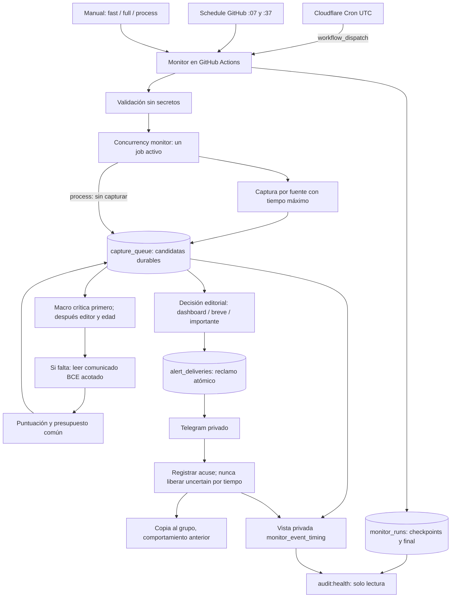

# Cadencia de News Monitor: reloj externo y ejecución corta

Este documento describe el cierre de la implementación local del 10-09-2026,
anterior a su activación. **El estado operativo posterior se registra en
[activacion-cadencia.md](activacion-cadencia.md)**; las referencias a pasos pendientes
de este documento corresponden al cierre local. No se ha generado PDF.

## Diagnóstico y referencia anterior

Repositorio comprobado en lectura: `seeorr/news-monitor`; rama predeterminada real: `main`. Referencia inicial: `037e77a`. Había dos archivos modificados: `docs/dos-niveles-noticias.md` y `scripts/evaluar-noticias.ts`. Se conservan íntegros; los SHA-256 originales están en `.cache/cadence-baseline/preserved-files.json`. En esa carpeta quedan HEAD, estado, diff previo y copias de los módulos afectados. El contenido confirmado puede reconstruirse con `git show 037e77a:<ruta>` más ese diff, sin restaurarlo sobre el trabajo actual.

Auditoría de Actions en lectura, ventana **09-09 13:59:46 UTC → 10-09 13:59:46 UTC**: 21 ejecuciones recuperadas; ventana cubierta; 11 `schedule` frente a 48 slots teóricos y 2 manuales. Mayor hueco entre ejecuciones programadas observadas: **185,4 minutos**. Último disparo observado: **10-09 11:49:05 UTC**, finalizado a las **11:50:01 UTC**, ejecución `34473299702`. No había otro posterior en esa lectura. `startedAt=createdAt` no prueba el inicio efectivo del job. Evidencia completa en `.cache/cadence-baseline/audit.txt` y `.cache/cadencia-2026-09-10T13-59-46-787Z.json`.

El GET público del [RSS del BCE](https://www.ecb.europa.eu/rss/press.html) devolvió 200 y el elemento `Monetary policy decisions`, con `pubDate=Thu, 10 Sep 2026 14:15:00 +0200`: **12:15 UTC**. No tenía descripción. El [comunicado oficial](https://www.ecb.europa.eu/press/pr/date/2026/html/ecb.mp260910~314e508016.en.html) confirmó la subida de 25 puntos básicos, depósito del 2,50 % y efectividad el 16 de septiembre. No se reenvió. La ausencia en Neon a las 12:58 procede del incidente aportado por Alberto; esta tarea no volvió a consultar esa fila remota.

La causa inmediata acreditada es el hueco de ejecución. No se atribuye retrospectivamente el incidente al filtro. La inspección local sí descubrió una limitación adicional: un título oficial sin entradilla necesita conservarse y enriquecerse antes de poder justificar una alerta detallada.

Antes del cambio ya existían: captura durable por fuente antes del cupo; estados `pending`, `processing`, `scored`, `discarded` con motivo y `retryable_failed`; leases de procesamiento; prioridades por editor y antigüedad; modo `capture-only` y `process-only`; presupuestos; entrega con reclamo previo; 40 archivos de tests. Se ha extendido esa arquitectura, sin sustituir sus registros de idempotencia.

## Arquitectura final

El Worker no tiene manejador HTTP, rutas públicas, watchlist, modelos ni Telegram. Solo hace un POST al dominio fijo `api.github.com`, sin redirecciones ni reintentos. Una aceptación de GitHub significa **dispatch aceptado**, no job iniciado ni noticia entregada.

## Perfiles, fuentes y límites

| Perfil | Captura | Procesamiento y entrega |
|---|---|---|
| `fast` | BCE siempre; Fed, Yahoo Finance y feeds de BoE/BoJ únicamente si están configurados/habilitados | Misma cola y presupuestos. Máximo 4 puntuaciones y 1 análisis profundo por ciclo, sin superar límites inferiores configurados. Macro crítica se entrega inmediatamente después de puntuar |
| `full` | Todos los feeds habilitados, FRED con clave, Eurostat, EDGAR con contacto/watchlist y precios vigilados | Límites actuales: por defecto 12 puntuaciones, 3 análisis profundos; cuota común |
| `process` | Ninguna fuente de noticias; puede leer la watchlist para contextualizar | Adapta `process-only`, usando las notas y entregas pendientes existentes |

`mode` controla efectos: `full` procesa y entrega; `capture-only` solo persiste; `process-only` conserva la entrada anterior. El input de workflow `auto` hereda `MONITOR_MODE` y se resuelve **antes** de validar/ejecutar; sustituye la opción vacía anterior, que actionlint rechazaba. Manual sin perfil usa `full`. `process + capture-only` falla por incompatibilidad. Perfil u origen desconocido falla antes de fuentes, estado, modelos y Telegram, también en el punto de entrada real.

Catálogo actual: ocho feeds `core`; `batch1` añade BLS empleo/IPC/PPI y EIA Today in Energy; `batch2`, BoE noticias/publicaciones y BoJ; candidatos `batch3` siguen sujetos a las restricciones documentadas en `fuentes-cobertura.md`. No se activan lotes nuevos aquí. `RSS_FEEDS` explícito manda sobre los lotes, salvo que `fast` incluye siempre BCE.

`fast`: captura total máxima 60 s, plazo por fuente hasta 15 s, cada RSS un intento de hasta 10 s, modelos hasta 20 s por petición sin reintentos de transporte. Enriquecer el comunicado BCE: un GET de hasta 8 s, máximo 1 MB leído y 12.000 caracteres de contexto. Fuente caída no borra lo ya capturado; fallo de persistencia aborta visiblemente. `full` mantiene los límites existentes y el job de Actions sigue acotado a 10 minutos. También full consulta primero el BCE y los feeds rápidos, antes de esperar a las APIs pesadas.

Los ciclos `fast`/`process`, `capture-only` y los Monitor fallidos no disparan trabajo matinal indirecto. La puerta de `brief.yml` se evalúa antes de dependencias y secretos. `full` correcto mantiene la recuperación matinal. Los workflows independientes de Agenda/Resumen no se desactivan con esta implementación.

## Cron y garantías reales

Cron UTC preparado: `3,13,23,33,43,53 * * * *`.

| Minutos | Estrategia final `mixed` |
|---|---|
| 03 y 33 | `full` |
| 13, 23, 43 y 53 | `fast` |
| 07 y 37 | `full`, respaldo GitHub independiente |

El intervalo principal solicitado es de diez minutos; captura completa cada treinta. La configuración versionada está **ENABLED=false**, **STRATEGY=fast-only**, **MONITOR_MODE=capture-only**. Durante observación los seis disparos externos piden `fast`.

Se conserva `concurrency.group=monitor`, `cancel-in-progress=false`: ningún nuevo disparo cancela un consumidor activo que podría estar enviando. GitHub puede reemplazar una ejecución pendiente por otra; este grupo no es una cola FIFO de todos los disparos. La cola de noticias sí persiste entre ellos. No hay runners durmiendo entre vueltas.

[GitHub documenta retrasos y posibles descartes de schedule](https://docs.github.com/en/actions/reference/workflows-and-actions/events-that-trigger-workflows#schedule). El reloj externo mejora el inicio de solicitudes, pero sigue dependiendo de la disponibilidad de Actions, de su espera en cola y de que el ciclo anterior termine. Los [Cron Triggers de Cloudflare](https://developers.cloudflare.com/workers/configuration/cron-triggers/) usan UTC y sus cambios pueden tardar hasta 15 minutos en propagarse. Ninguno de estos servicios acredita por sí solo el objetivo publicación→Telegram.

## Prioridad, contexto y duplicados

La clasificación crítica se persiste en el snapshot antes del límite SQL de lectura. Un BCE recién capturado entra aunque haya más de 500 pendientes. Los críticos usan el cupo existente antes de la rotación de editores; en el resto siguen la equidad y el envejecimiento. Una saturación continua de macro crítica puede retrasar otros temas: se mide como cola envejecida, no se aumenta automáticamente el presupuesto.

Se reconocen decisiones de tipos y movimientos confirmados de bancos centrales, cambios de compras/reinversiones/liquidez, publicaciones prioritarias de IPC/PIB/empleo y previsiones oficiales materiales. Un discurso, acta o investigación no gana el carril crítico por ser oficial. Rumores y expectativas no se convierten en decisiones confirmadas.

Un comunicado BCE sin descripción pasa a pendiente con evidencia limitada. Al reclamarlo, se lee únicamente una URL HTTPS del patrón oficial de decisiones monetarias del BCE. El contexto enriquecido y la puntuación se guardan juntos, manteniendo la publicación y primera captura originales. Si falla la lectura o el modelo, queda reintentable.

La equivalencia BCE exige banco, nivel del depósito, variación en puntos básicos y fecha compatible. Une prensa y comunicado aunque cambie el titular, en ambos órdenes de llegada. La serie estructurada `ECBDFR` puede enlazarse hasta 14 días después si coinciden nivel **y variación**, sin fingir que su periodo es una publicación. Otros indicadores mantienen la agrupación conservadora anterior. Si faltan cifras o hay ambigüedad, no se afirma equivalencia. No se promete deduplicación semántica universal. Cambios de nivel/variación o una corrección material identificada siguen siendo decisiones distintas; una nueva versión requiere identidad de evento distinta en la fuente.

Capturar dos veces el mismo id no crea trabajo nuevo. Una historia puntuada no vuelve al modelo. `scored + delivery_pending` sobrevive a reinicios. `sending`, `uncertain` y `rejected` nunca se liberan por edad ni se reenvían automáticamente; requieren revisión humana. Una entrega incierta tampoco repite su análisis. Estas garantías corresponden al chat privado. La copia al grupo conserva su limitación previa: es secundaria y no tiene reclamo independiente.

## Telemetría y salud

Migración preparada: `neon/migrations/20260910_run_cadence.sql`. Añade `monitor_runs`, índice de prioridad y vista privada `monitor_event_timing`. Clasifica pendientes antiguos inequívocos, sin reabrir descartes ni liberar reclamos. `RUN_TELEMETRY` está habilitado por defecto en la configuración del programa: **aplicar primero la migración autorizada**, o usar temporalmente `RUN_TELEMETRY=false` con la limitación de observabilidad declarada.

Cada ejecución guarda UUID privado, perfil, origen (`external`, `schedule`, `manual`), modo, inicio/final, checkpoint de captura, estado, fuentes correctas/fallidas, fallos críticos por feed público, apariciones capturadas, únicas, pendientes antes/después, fecha de la más antigua, puntuadas y mensajes enviados. `origin` es una etiqueta operativa, no una prueba de identidad ni autorización.

Las cuatro fechas viven en sus registros propietarios: `publication_at`, `first_captured_at`, `processed_at` y `alert_deliveries.settled_at` si `sent`. `data_period_at` permanece separado. La vista calcula minutos publicación→captura y publicación→acuse; null significa desconocido. El acuse de Telegram no significa lectura humana. `sent` de la ejecución cuenta mensajes, no necesariamente noticias, porque un breve puede agrupar varias.

La lectura operativa es `npm run audit:health` con las credenciales locales habituales; solo ejecuta SELECT. No ejecutar `npm start` para diagnosticar producción. El informe imprime agregados y vocabulario seguro, sin ids de eventos, titulares, símbolos, URLs ni errores de terceros.

| Objetivo configurable | Variable | Defecto |
|---|---|---:|
| Captura crítica reciente | `HEALTH_FAST_MINUTES` | 15 min |
| Full correcto reciente | `HEALTH_FULL_MINUTES` | 45 min |
| Sin ejecutar | `HEALTH_NO_EXECUTION_MINUTES` | 90 min |
| Pendiente envejecida | `HEALTH_QUEUE_MINUTES` | 120 min |
| Publicación→captura crítica | `HEALTH_RATE_CAPTURE_MINUTES` | <10 min |
| Publicación→entrega crítica | `HEALTH_RATE_ALERT_MINUTES` | <15 min |

Estados: `healthy`, `delayed`, `no_recent_execution`, `critical_source_failed`, `aged_queue`, `delivery_blocked`; pueden coexistir. Un `process` correcto no acredita captura. Una fuente crítica fallida permanece así hasta que esa misma fuente responda. Los incumplimientos de latencia se cuentan en una ventana privada de siete días; no se ocultan al llegar un job verde.

El aviso operativo está preparado mediante `privateHealthNotice` y `sendOperationalNotice`. El CLI lo conecta al chat privado existente **solo si coinciden `HEALTH_NOTICES_ENABLED=true` y `npm run audit:health -- --notify`**. Por defecto está apagado; no se programa ni se invoca desde main. Máximo un intento diario UTC, con identidad `operational-health:fecha` en el ledger, sin crear eventos financieros. Un acuse incierto no se reenvía. Todas sus pruebas usan transporte simulado. No se ha usado el nuevo Worker para consultar datos privados. Sin un observador independiente activo, una caída completa requiere consultar el informe: esta entrega no promete avisos autónomos de salud ya funcionando.

## Carga, coste y condiciones de fuentes

Estimación para `core`, con FRED configurado, todos los disparos entregados y sin manuales:

- Worker: **144 invocaciones y POST/día**. Estrategia final: 48 full + 96 fast.
- Respaldo: hasta 48 full/día. Total Monitor: **hasta 192 jobs/día**, con 96 full y 96 fast. Los full consultan también las fuentes rápidas: hasta 192 consultas/día por fuente crítica habilitada, no solo 144. Puede haber separación de cuatro minutos con el respaldo puntual.
- Core fast: BCE, Fed y Yahoo; 3 tareas de fuente. Core full: 8 RSS + 5 series FRED + 4 Eurostat = 17 tareas, más empresas/precios vigilados. Total base **1.920 tareas de fuente/día**: 1.056 RSS + 480 FRED + 384 Eurostat. Son tareas, no necesariamente solicitudes HTTP: reintentos, resolución de agregados, archivos SEC y mapas de empresas pueden añadir solicitudes.
- Cada feed adicional de BoE/BoJ habilitado añade hasta 192 consultas/día. Cada fuente exclusiva full, hasta 96 tareas/día. EDGAR/precios nunca se consultan desde fast.
- `workflow_run` puede crear además hasta 192 jobs cortos de comprobación del Resumen; fast/process salen antes de dependencias. En días laborables, full puede ofrecer hasta 24 recuperaciones en su ventana de seis horas. Agenda/Resumen independientes y consultas de esas recuperaciones no están incluidos en las 1.920 tareas de Monitor.
- Sin candidatas pendientes nuevas: cero llamadas al modelo. El máximo teórico de slots de scoring sube, pero el límite diario compartido sigue en **120 peticiones de IA**, incluidos análisis/reintentos de formato. Límites editoriales por defecto: 24 noticias breves y 12 importantes al día. No se han ampliado.
- Historial: hasta 192 filas nuevas/día. Con 1 KB de payload por ejecución: ~0,2 MB/día y 17 MB/90 días antes de índices/MVCC. Checkpoints: aproximadamente 2.500 actualizaciones pequeñas/día en el escenario base. Hay más actividad de Neon aunque no aparezcan noticias nuevas; medir compute, almacenamiento, WAL y auto-suspensión antes de mantenerlo indefinidamente.
- Cola: repetidas actualizan contador, no crean filas. Ejemplo orientativo: 250 únicas/día × 2 KB ≈ 0,5 MB/día de snapshots, más índices/decisiones/análisis. Un comunicado enriquecido puede añadir hasta 12 KB. No se añade purga automática: no borrar backlog ni ledger para ahorrar espacio.

[Workers Free](https://developers.cloudflare.com/workers/platform/limits/) publica 100.000 solicitudes/día, 10 ms de CPU por invocación, 50 subrequests y 5 cron triggers por cuenta. El Worker usa un trigger y un POST por invocación; el tiempo esperando HTTP no equivale a CPU. El bundle local es ~3,2 KiB (~1,4 KiB gzip). Hay que observar CPU y errores reales; el dry-run no mide carga desplegada. Consultar también [precios oficiales](https://developers.cloudflare.com/workers/platform/pricing/): no seleccionar Workers Paid ni asumir que el resto del sistema es gratuito por caber este reloj en Free.

Condiciones contrastadas el 10-09-2026:

| Fuente | Frecuencia asignada y fundamento |
|---|---|
| BCE | Fast/full. Su [catálogo RSS](https://www.ecb.europa.eu/home/html/rss.en.html) contempla consulta periódica con frecuencia elegida por el lector. Sin mínimo numérico publicado en esa página. [Reutilización](https://www.ecb.europa.eu/services/using-our-site/disclaimer/html/index.en.html): atribución y fidelidad; distinguir la interpretación propia |
| Fed | Fast/full. [Catálogo oficial](https://www.federalreserve.gov/feeds/feeds.htm) ofrece feeds para lectores automáticos. No se encontró un intervalo mínimo publicado allí; una consulta por job, sin ráfagas de reintentos en fast |
| BoE | Fast/full solo cuando ya esté habilitado. [Catálogo](https://www.bankofengland.co.uk/rss) y [condiciones](https://www.bankofengland.co.uk/legal); atribución y restricciones de reutilización. No se ha inferido licencia abierta ni garantía de acceso ilimitado |
| BoJ | Fast/full solo habilitado. Catálogo enlazado desde su [web oficial](https://www.boj.or.jp/en/); [condiciones](https://www.boj.or.jp/en/copyright.htm) exigen atribución y restringen reutilización comercial y modificaciones. Análisis propio separado del contenido original |
| Yahoo Finance | Respaldo rápido configurado. Las [condiciones RSS](https://legal.yahoo.com/xw/en/yahoo/terms/otos/index.html) contemplan feeds con atribución y enlace; no autorizan modificar su contenido ni conceden redistribución irrestricta. Mantener uso personal y distinguir análisis propio. No consta intervalo numérico mínimo en el texto consultado |
| CNBC / Investing | Permanecen full; no se añaden al fast. CNBC bloqueó la consulta al catálogo en esta auditoría: su verificación de frecuencia queda pendiente. Investing conserva sus restricciones y los dos feeds nuevos deshabilitados. Que exista un endpoint no equivale a permiso de uso ilimitado |
| BLS / EIA / FRED / Eurostat / EDGAR / precios | Full, sin añadirlos a fast. Catálogos y restricciones anteriores en `fuentes-cobertura.md`; el aumento potencial por el respaldo se declara arriba. Mantener el limitador compartido de SEC y respetar 429/fallos. No se ha probado una jornada de sondeo real ni concedido nuevas licencias |

La inexistencia de un límite numérico en una página no prueba permiso ilimitado. No se evaden bloqueos. Si la observación muestra 429, restricciones específicas o un presupuesto de infraestructura insuficiente, reducir la selección/frecuencia antes de ampliar; no contratar automáticamente.

## Seguridad del despachador

Variables públicas exactas en `cloudflare-dispatcher/wrangler.json`: `ENABLED`, `GITHUB_OWNER=seeorr`, `GITHUB_REPO=news-monitor`, `GITHUB_WORKFLOW=monitor.yml`, `GITHUB_REF=main`, `STRATEGY` y `MONITOR_MODE`.

Único secreto nuevo: **`GITHUB_TOKEN` en el Worker de Cloudflare**. No se almacena en variables públicas, `.dev.vars`, repositorio ni fixtures. Es distinto del token efímero propio de un job de Actions.

Token fino de GitHub: propietario correcto; **solo `news-monitor`**; permiso de repositorio **Actions: Read and write**; **Metadata: Read-only** implícito. Ningún permiso de administración, Contents write ni otros repositorios. Actions write es el permiso mínimo soportado por la [API de dispatch](https://docs.github.com/en/rest/actions/workflows#create-a-workflow-dispatch-event), pero es más amplio que únicamente disparar: no presentarlo como un token de una sola operación. Fijar caducidad corta (por ejemplo 30 días) y responsable de renovación.

API fijada a `2026-03-10`, cabeceras Accept/Authorization/Content-Type/User-Agent. Se acepta 204 y también el 200 documentado por la API actual. 401/403/404/422/429 → rechazo; timeout → timeout; error de transporte, redirección o respuesta inesperada → incierto. No se leen ni imprimen cuerpos externos, cabeceras o token; no se repite un dispatch incierto. Un error seguro se propaga para quedar visible en Cron Events.

Rotación futura: crear sustituto con el mismo alcance/caducidad; actualizar **solo** el secreto del Worker; observar un dispatch aceptado y su job; revocar el anterior desde GitHub Settings → Developer settings → Fine-grained personal access tokens. Revocación de emergencia corta nuevos dispatch autorizados sin esperar propagación del cron. Comprobar registros buscando patrones de credenciales de forma local y sin imprimir coincidencias; revisar también permisos y alcance del nuevo token. Nunca pegar valores en comandos visibles, logs o esta documentación.

## Activación progresiva: solo pasos futuros de Alberto

1. Revisar diff completo y pruebas. Autorizar publicación del código/workflows en `main` y la migración aditiva de cadencia; comprobar también que las migraciones anteriores de cola, entrega y control ya existen. **Nada de esto se ha aplicado remotamente.** El migrador general reejecuta todos los SQL: revisar su alcance antes de usarlo.
2. Preparar observación: `MONITOR_MODE=capture-only` en las variables de Actions. Para garantizar cero envíos/modelos durante esa ventana, pausar por separado los workflows independientes Agenda/Resumen y cualquier disparador anterior. Guardar sus estados para restaurarlos. No usar `--dry` como sustituto: puede llamar a modelos.
3. En `cloudflare-dispatcher`, ejecutar `npm ci` y `npm run validate`. El segundo es `wrangler deploy --dry-run` y no despliega. Elegir una cuenta Workers Free tras revisar límites disponibles.
4. **Con autorización**, desplegar el Worker con `ENABLED=false` mediante `npx wrangler deploy`. No añadir rutas HTTP. Confirmar que sigue desactivado.
5. Alberto crea el token fino restringido y lo carga en Cloudflare → Worker → Settings → Variables and Secrets → **Secret `GITHUB_TOKEN`**. Alternativa interactiva futura: `npx wrangler secret put GITHUB_TOKEN`, sin valor en la línea de comandos. No se ha ejecutado ni creado ningún token.
6. Mantener `STRATEGY=fast-only` y `MONITOR_MODE=capture-only` en Cloudflare. Cambiar `ENABLED=true` y aplicar la configuración autorizada. Observar varias horas: seis solicitudes externas/hora; perfil visible en Actions; cola persistente; modelos y Telegram sin llamadas. `RUN_TELEMETRY=true` requiere migración ya aplicada.
7. Comparar `monitor_runs` con Cron Events y `gh run list`; ejecutar `npm run audit:health` en lectura. Verificar fuentes críticas, pendientes, antigüedad y fechas. Confirmar que recapturar incrementa apariciones pero no únicas ni puntuaciones.
8. Autorizar procesamiento: cambiar `MONITOR_MODE=full` tanto en Worker como en las variables de Actions. Mantener por ahora `STRATEGY=fast-only`. **Revisar primero el backlog capturado**: puede producir alertas al habilitar procesamiento; no usar `--force`, borrar SeenStore ni reenviar deliberadamente el incidente histórico.
9. Con idempotencia y carga verificadas, cambiar a `STRATEGY=mixed`: full en 03/33 y fast en el resto. Mantener el cron interno. Restaurar los workflows matinales que se hubieran pausado, verificando sus propios presupuestos/entregas.
10. Medir varias publicaciones reales futuras: publicación→primera captura <10 min; publicación→acuse <15 min; fast ≤15 min y full ≤45 min desde captura correcta. Incluir esperas de Actions, modelos, errores y cuotas agotadas en el informe. No declarar SLO cumplido con una simulación.
11. El aviso privado de salud es optativo y sigue apagado. Para activarlo, definir `HEALTH_NOTICES_ENABLED=true` y ejecutar `npm run audit:health -- --notify` desde un entorno autorizado con los secretos existentes `DATABASE_URL`, `TELEGRAM_BOT_TOKEN` y `TELEGRAM_CHAT_ID`. Para vigilancia autónoma, programar después ese comando en un observador independiente, con frecuencia aprobada. No añadir acceso a Neon/Telegram al Worker de dispatch. La auditoría sin `--notify` sigue siendo de lectura aunque la variable esté activada.

## Reversión

Detener primero nuevas solicitudes: revocar el token en GitHub si la parada es urgente; poner `ENABLED=false` en el Worker; retirar su Cron Trigger si se quiere retirar Cloudflare por completo. Los cambios de cron pueden tardar en propagarse. Un job ya iniciado sigue con su token efímero de Actions: revocar el PAT no lo cancela. No cancelar a ciegas un job que pueda estar enviando; dejar que cierre el reclamo o revisar su estado.

GitHub `:07/:37` sigue siendo el respaldo full. Para detener **todo** procesamiento, usar `MONITOR_MODE=capture-only` en Actions además de retirar el reloj externo, y revisar otros workflows. Para volver al software anterior, conservar `capture_queue`, `news_usage`, `news_decisions` y `alert_deliveries`; no restaurar una base antigua encima ni limpiar incertidumbres. `RUN_TELEMETRY=false` permite deshabilitar la nueva escritura de runs. La migración incluye el DDL inverso opcional; solo usarlo con consumidores parados y exportación verificada. La reversión operativa recomendada deja los datos de auditoría.

## Verificación local y mapa de cambios

- Worker y pruebas: `cloudflare-dispatcher/`, `test/clock-worker.test.ts`. Elección de minutos, cuerpo/ref, 204/200, rechazos, timeout, incertidumbre, secretos simulados, redirecciones prohibidas y apagado.
- Perfiles y cadena de workflows: `src/pipeline/profile.ts`, `scripts/validate-profile.mjs`, `monitor.yml`, `brief.yml`; tests de perfil, captura, concurrencia y punto de entrada real.
- Prioridad/identidad: `critical-macro.ts`, `queue-plan.ts`, `agrupar.ts`, `queue.ts`, adaptador Neon, `queue-cycle.ts`, `relevance.ts`, contrato de evento y `ecb-release.ts`. Tests con 520 pendientes, persistencia/reinicio, cuota agotada, fuente/modelo fallido, prensa en ambos órdenes, actualización material, ECBDFR posterior y entrega incierta.
- Orquestación/entrega: `main.ts`, `collect.ts`, `news-delivery.ts`, `config.ts`, logger seguro y decodificación HTML. Sin cambios en las credenciales ni los presupuestos diarios.
- Salud: `cadence.ts` en pipeline y db, migración aditiva, `auditar-salud.ts`, `verificar-cadencia-postgres.ts`, tests de salud. SQL ejecutado con PGlite local, incluidos índices, checkpoints, vista de latencias y reversión sin tocar cola/ledger.
- Red de tests: `test/setup-no-network.ts` y `vitest.config.ts` bloquean fetch por defecto; cada test sustituye explícitamente su frontera. Escáner de patrones: `scripts/verificar-seguridad-cadencia.mjs`, solo árbol versionable e historial local alcanzable, sin valores impresos.

Comandos reproducibles: `npm run typecheck`, `npm test`, `npm run verify:queue:postgres`, `npm run verify:control:postgres`, `npm run verify:cadence:postgres`, `npm run dashboard:build`; `npm run validate` dentro de `cloudflare-dispatcher`; actionlint sobre ambos workflows. PGlite local se prepara con el procedimiento de `scripts/verificar-cola-postgres.ts`. Resultados concretos de cierre en `verificacion-cadencia.md`.

**Pendiente en producción:** publicación de esta revisión, migración, Worker, token, activación, carga/CPU reales, límites de Neon, observación de fuentes bajo la nueva frecuencia y medición de varias publicaciones. No se ha demostrado que Telegram vuelva a recibir noticias en producción durante esta tarea, porque se ha respetado la prohibición de ejecutarlo o enviar mensajes reales.
